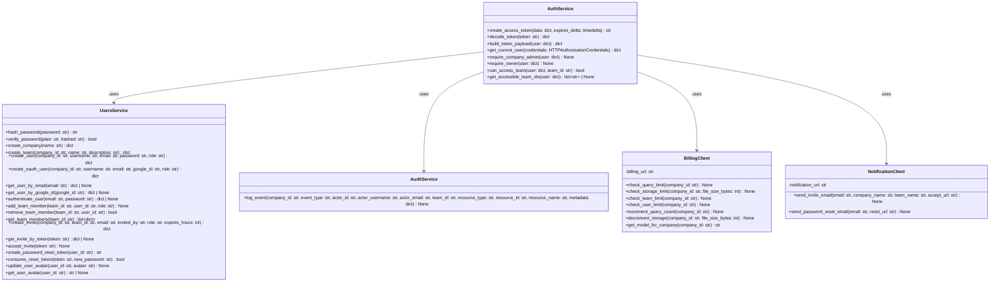
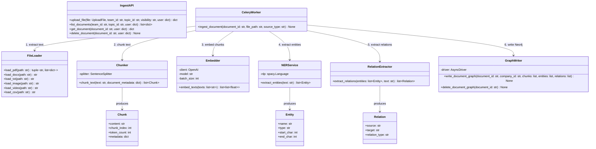
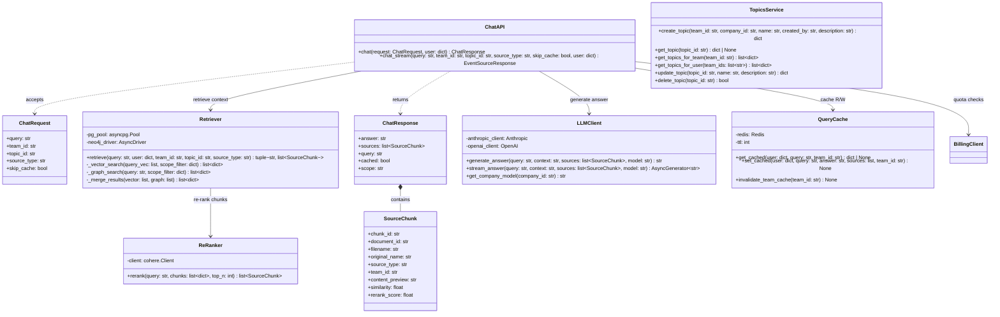
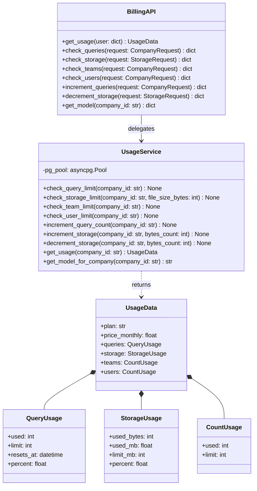
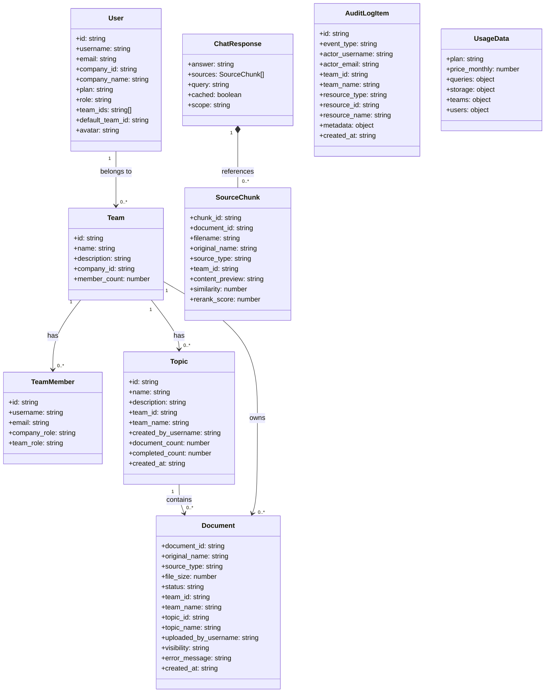

# Class Diagram

## Auth Service

```mermaid
classDiagram
    class AuthService {
        +create_access_token(data: dict, expires_delta: timedelta) str
        +decode_token(token: str) dict
        +build_token_payload(user: dict) dict
        +get_current_user(credentials: HTTPAuthorizationCredentials) dict
        +require_company_admin(user: dict) None
        +require_owner(user: dict) None
        +can_access_team(user: dict, team_id: str) bool
        +get_accessible_team_ids(user: dict) list~str~ | None
    }

    class UsersService {
        +hash_password(password: str) str
        +verify_password(plain: str, hashed: str) bool
        +create_company(name: str) dict
        +create_team(company_id: str, name: str, description: str) dict
        +create_user(company_id: str, username: str, email: str, password: str, role: str) dict
        +create_oauth_user(company_id: str, username: str, email: str, google_id: str, role: str) dict
        +get_user_by_email(email: str) dict | None
        +get_user_by_google_id(google_id: str) dict | None
        +authenticate_user(email: str, password: str) dict | None
        +add_team_member(team_id: str, user_id: str, role: str) None
        +remove_team_member(team_id: str, user_id: str) bool
        +get_team_members(team_id: str) list~dict~
        +create_invite(company_id: str, team_id: str, email: str, invited_by: str, role: str, expires_hours: int) dict
        +get_invite_by_token(token: str) dict | None
        +accept_invite(token: str) None
        +create_password_reset_token(user_id: str) str
        +consume_reset_token(token: str, new_password: str) bool
        +update_user_avatar(user_id: str, avatar: str) None
        +get_user_avatar(user_id: str) str | None
    }

    class AuditService {
        +log_event(company_id: str, event_type: str, actor_id: str, actor_username: str, actor_email: str, team_id: str, resource_type: str, resource_id: str, resource_name: str, metadata: dict) None
    }

    class BillingClient {
        -billing_url: str
        +check_query_limit(company_id: str) None
        +check_storage_limit(company_id: str, file_size_bytes: int) None
        +check_team_limit(company_id: str) None
        +check_user_limit(company_id: str) None
        +increment_query_count(company_id: str) None
        +decrement_storage(company_id: str, file_size_bytes: int) None
        +get_model_for_company(company_id: str) str
    }

    class NotificationClient {
        -notification_url: str
        +send_invite_email(email: str, company_name: str, team_name: str, accept_url: str) None
        +send_password_reset_email(email: str, reset_url: str) None
    }

    AuthService --> UsersService : uses
    AuthService --> AuditService : uses
    AuthService --> BillingClient : uses
    AuthService --> NotificationClient : uses
```

---

## Ingestion Service

```mermaid
classDiagram
    class IngestAPI {
        +upload_file(file: UploadFile, team_id: str, topic_id: str, visibility: str, user: dict) dict
        +list_documents(team_id: str, topic_id: str, user: dict) list~dict~
        +get_document(document_id: str, user: dict) dict
        +delete_document(document_id: str, user: dict) None
    }

    class CeleryWorker {
        +ingest_document(document_id: str, file_path: str, source_type: str) None
    }

    class FileLoader {
        +load_pdf(path: str) tuple~str, list~dict~~
        +load_docx(path: str) str
        +load_txt(path: str) str
        +load_image(path: str) str
        +load_video(path: str) str
        +load_csv(path: str) str
    }

    class Chunker {
        -splitter: SentenceSplitter
        +chunk_text(text: str, document_metadata: dict) list~Chunk~
    }

    class Chunk {
        +content: str
        +chunk_index: int
        +token_count: int
        +metadata: dict
    }

    class Embedder {
        -client: OpenAI
        -model: str
        -batch_size: int
        +embed_texts(texts: list~str~) list~list~float~~
    }

    class NERService {
        -nlp: spacy.Language
        +extract_entities(text: str) list~Entity~
    }

    class Entity {
        +name: str
        +type: str
        +start_char: int
        +end_char: int
    }

    class RelationExtractor {
        +extract_relations(entities: list~Entity~, text: str) list~Relation~
    }

    class Relation {
        +source: str
        +target: str
        +relation_type: str
    }

    class GraphWriter {
        -driver: AsyncDriver
        +write_document_graph(document_id: str, company_id: str, chunks: list, entities: list, relations: list) None
        +delete_document_graph(document_id: str) None
    }

    CeleryWorker --> FileLoader : 1. extract text
    CeleryWorker --> Chunker : 2. chunk text
    CeleryWorker --> Embedder : 3. embed chunks
    CeleryWorker --> NERService : 4. extract entities
    CeleryWorker --> RelationExtractor : 5. extract relations
    CeleryWorker --> GraphWriter : 6. write Neo4j
    Chunker --> Chunk : produces
    NERService --> Entity : produces
    RelationExtractor --> Relation : produces
```

---

## Chat Service

```mermaid
classDiagram
    class ChatAPI {
        +chat(request: ChatRequest, user: dict) ChatResponse
        +chat_stream(query: str, team_id: str, topic_id: str, source_type: str, skip_cache: bool, user: dict) EventSourceResponse
    }

    class ChatRequest {
        +query: str
        +team_id: str
        +topic_id: str
        +source_type: str
        +skip_cache: bool
    }

    class ChatResponse {
        +answer: str
        +sources: list~SourceChunk~
        +query: str
        +cached: bool
        +scope: str
    }

    class SourceChunk {
        +chunk_id: str
        +document_id: str
        +filename: str
        +original_name: str
        +source_type: str
        +team_id: str
        +content_preview: str
        +similarity: float
        +rerank_score: float
    }

    class Retriever {
        -pg_pool: asyncpg.Pool
        -neo4j_driver: AsyncDriver
        +retrieve(query: str, user: dict, team_id: str, topic_id: str, source_type: str) tuple~str, list~SourceChunk~~
        -_vector_search(query_vec: list, scope_filter: dict) list~dict~
        -_graph_search(query: str, scope_filter: dict) list~dict~
        -_merge_results(vector: list, graph: list) list~dict~
    }

    class ReRanker {
        -client: cohere.Client
        +rerank(query: str, chunks: list~dict~, top_n: int) list~SourceChunk~
    }

    class LLMClient {
        -anthropic_client: Anthropic
        -openai_client: OpenAI
        +generate_answer(query: str, context: str, sources: list~SourceChunk~, model: str) str
        +stream_answer(query: str, context: str, sources: list~SourceChunk~, model: str) AsyncGenerator~str~
        +get_company_model(company_id: str) str
    }

    class QueryCache {
        -redis: Redis
        -ttl: int
        +get_cached(user: dict, query: str, team_id: str) dict | None
        +set_cached(user: dict, query: str, answer: str, sources: list, team_id: str) None
        +invalidate_team_cache(team_id: str) None
    }

    class TopicsService {
        +create_topic(team_id: str, company_id: str, name: str, created_by: str, description: str) dict
        +get_topic(topic_id: str) dict | None
        +get_topics_for_team(team_id: str) list~dict~
        +get_topics_for_user(team_ids: list~str~) list~dict~
        +update_topic(topic_id: str, name: str, description: str) dict
        +delete_topic(topic_id: str) bool
    }

    ChatAPI --> Retriever : retrieve context
    ChatAPI --> LLMClient : generate answer
    ChatAPI --> QueryCache : cache R/W
    ChatAPI --> BillingClient : quota checks
    Retriever --> ReRanker : re-rank chunks
    ChatAPI ..> ChatRequest : accepts
    ChatAPI ..> ChatResponse : returns
    ChatResponse *-- SourceChunk : contains
```

---

## Billing Service

```mermaid
classDiagram
    class BillingAPI {
        +get_usage(user: dict) UsageData
        +check_queries(request: CompanyRequest) dict
        +check_storage(request: StorageRequest) dict
        +check_teams(request: CompanyRequest) dict
        +check_users(request: CompanyRequest) dict
        +increment_queries(request: CompanyRequest) dict
        +decrement_storage(request: StorageRequest) dict
        +get_model(company_id: str) dict
    }

    class UsageService {
        -pg_pool: asyncpg.Pool
        +check_query_limit(company_id: str) None
        +check_storage_limit(company_id: str, file_size_bytes: int) None
        +check_team_limit(company_id: str) None
        +check_user_limit(company_id: str) None
        +increment_query_count(company_id: str) None
        +increment_storage(company_id: str, bytes_count: int) None
        +decrement_storage(company_id: str, bytes_count: int) None
        +get_usage(company_id: str) UsageData
        +get_model_for_company(company_id: str) str
    }

    class UsageData {
        +plan: str
        +price_monthly: float
        +queries: QueryUsage
        +storage: StorageUsage
        +teams: CountUsage
        +users: CountUsage
    }

    class QueryUsage {
        +used: int
        +limit: int
        +resets_at: datetime
        +percent: float
    }

    class StorageUsage {
        +used_bytes: int
        +used_mb: float
        +limit_mb: int
        +percent: float
    }

    class CountUsage {
        +used: int
        +limit: int
    }

    BillingAPI --> UsageService : delegates
    UsageService ..> UsageData : returns
    UsageData *-- QueryUsage
    UsageData *-- StorageUsage
    UsageData *-- CountUsage
```

---

## Frontend React Hooks & Types

```mermaid
classDiagram
    class User {
        +id: string
        +username: string
        +email: string
        +company_id: string
        +company_name: string
        +plan: string
        +role: string
        +team_ids: string[]
        +default_team_id: string
        +avatar: string
    }

    class Team {
        +id: string
        +name: string
        +description: string
        +company_id: string
        +member_count: number
    }

    class TeamMember {
        +id: string
        +username: string
        +email: string
        +company_role: string
        +team_role: string
    }

    class Document {
        +document_id: string
        +original_name: string
        +source_type: string
        +file_size: number
        +status: string
        +team_id: string
        +team_name: string
        +topic_id: string
        +topic_name: string
        +uploaded_by_username: string
        +visibility: string
        +error_message: string
        +created_at: string
    }

    class Topic {
        +id: string
        +name: string
        +description: string
        +team_id: string
        +team_name: string
        +created_by_username: string
        +document_count: number
        +completed_count: number
        +created_at: string
    }

    class ChatResponse {
        +answer: string
        +sources: SourceChunk[]
        +query: string
        +cached: boolean
        +scope: string
    }

    class SourceChunk {
        +chunk_id: string
        +document_id: string
        +filename: string
        +original_name: string
        +source_type: string
        +team_id: string
        +content_preview: string
        +similarity: number
        +rerank_score: number
    }

    class AuditLogItem {
        +id: string
        +event_type: string
        +actor_username: string
        +actor_email: string
        +team_id: string
        +team_name: string
        +resource_type: string
        +resource_id: string
        +resource_name: string
        +metadata: object
        +created_at: string
    }

    class UsageData {
        +plan: string
        +price_monthly: number
        +queries: object
        +storage: object
        +teams: object
        +users: object
    }

    Topic "1" --> "0..*" Document : contains
    Team "1" --> "0..*" TeamMember : has
    Team "1" --> "0..*" Topic : has
    Team "1" --> "0..*" Document : owns
    User "1" --> "0..*" Team : belongs to
    ChatResponse "1" *-- "0..*" SourceChunk : references
```
