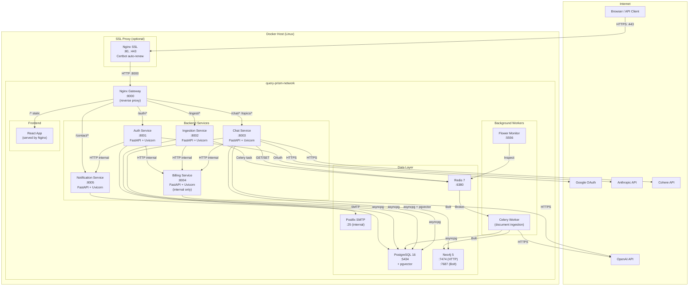

# Deployment Diagram

## Docker Compose Services



---

## Port Reference

| Container | Internal Port | Host Port | Accessible From |
|-----------|--------------|-----------|----------------|
| nginx-gateway | 80 | 8000 | Public (via SSL proxy) |
| auth-service | 8001 | 8001 | Internal + Gateway |
| ingestion-service | 8002 | 8002 | Internal + Gateway |
| chat-service | 8003 | 8003 | Internal + Gateway |
| billing-service | 8004 | 8004 | Internal only |
| notification-service | 8005 | 8005 | Internal + Gateway (/contact) |
| postgres | 5432 | 5434 | Internal + Host dev |
| neo4j-http | 7474 | 7474 | Internal + Host dev |
| neo4j-bolt | 7687 | 7687 | Internal |
| redis | 6379 | 6380 | Internal + Host dev |
| flower | 5555 | 5556 | Host dev only |
| nginx-ssl | 80/443 | 80/443 | Public |

---

## Volume Mounts

| Volume | Mount Path | Purpose |
|--------|-----------|---------|
| `postgres_data` | `/var/lib/postgresql/data` | PostgreSQL persistent data |
| `neo4j_data` | `/data` | Neo4j persistent data |
| `redis_data` | `/data` | Redis persistence (AOF) |
| `uploads` | `/app/uploads` | Uploaded document files (shared between ingestion svc + celery worker) |
| `certbot_conf` | `/etc/letsencrypt` | SSL certificate store |
| `certbot_www` | `/var/www/certbot` | ACME challenge files |

---

## Network Topology

All services share the `query-prism-network` Docker bridge network. Service-to-service communication uses container names as hostnames:

```
auth-service      → http://billing-service:8004
auth-service      → http://notification-service:8005
ingestion-service → http://billing-service:8004
chat-service      → http://billing-service:8004
celery-worker     → postgresql://postgres:5432/queryprism
celery-worker     → bolt://neo4j:7687
```

The Billing Service and Notification Service (for internal endpoints) are **not routed through Nginx** — only direct internal HTTP is used.

---

## Production Deployment Checklist

- [ ] Set `SECRET_KEY` to a cryptographically random 32+ byte value
- [ ] Set `OPENAI_API_KEY`, `ANTHROPIC_API_KEY`, `COHERE_API_KEY`
- [ ] Set `GOOGLE_CLIENT_ID`, `GOOGLE_CLIENT_SECRET`, `GOOGLE_REDIRECT_URL`
- [ ] Configure `SMTP_*` environment variables for email delivery
- [ ] Configure Certbot with your domain for HTTPS
- [ ] Set `DATABASE_URL` with production credentials
- [ ] Set `NEO4J_PASSWORD` to a strong password
- [ ] Mount persistent volumes for PostgreSQL, Neo4j, Redis, and uploads
- [ ] Restrict Billing Service (8004) to internal network only (already done in Nginx config)
- [ ] Enable Redis AOF persistence for durability
- [ ] Set up log rotation for all service containers
- [ ] Configure Flower with authentication for the monitoring UI
