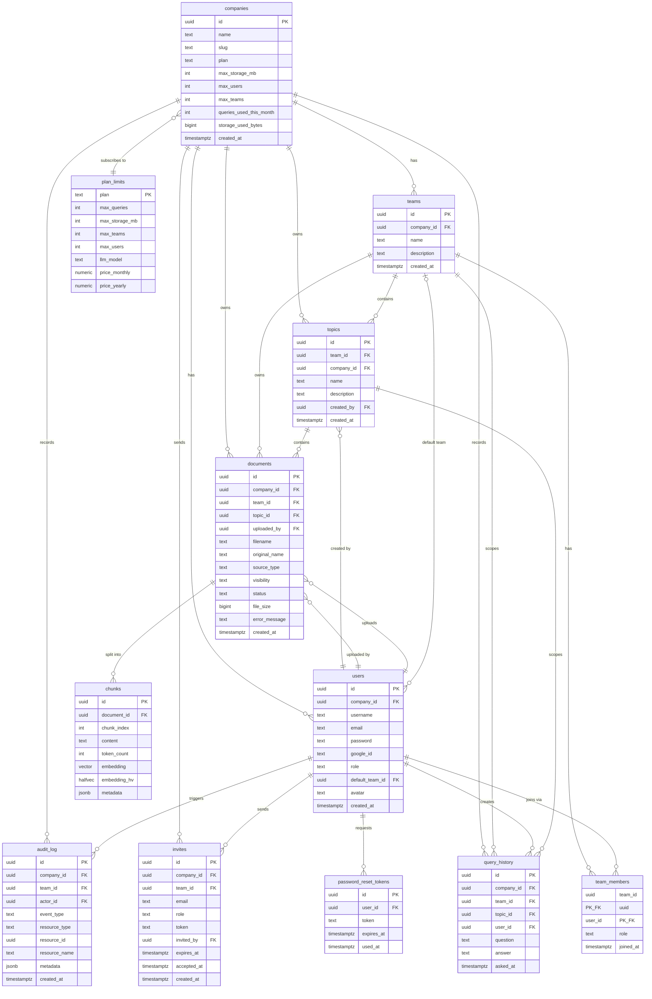
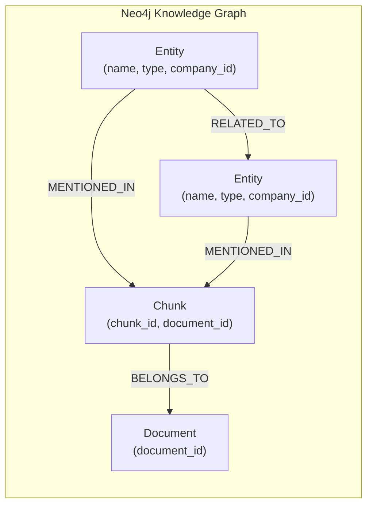

# Entity-Relationship Diagram

## Full PostgreSQL ER Diagram

---

## Neo4j Graph Schema

**Entity Types** (spaCy `en_core_web_sm` labels):

| Label | Description |
|-------|-------------|
| `PERSON` | People, including fictional |
| `ORG` | Companies, agencies, institutions |
| `GPE` | Countries, cities, states |
| `LOC` | Non-GPE locations |
| `PRODUCT` | Products, objects |
| `DATE` | Absolute or relative dates |
| `MONEY` | Monetary values |
| `LAW` | Named documents / laws |

---

## Relationship Cardinality Summary

| Relationship | Cardinality | Notes |
|-------------|-------------|-------|
| Company → Teams | 1:N | A company has many teams |
| Company → Users | 1:N | All users belong to one company |
| Team ↔ Users | M:N | Via `team_members` junction |
| Team → Topics | 1:N | Topics are folders within teams |
| Team → Documents | 1:N | Documents are owned by teams |
| Topic → Documents | 1:N | Optional grouping |
| Document → Chunks | 1:N | A document is split into many chunks |
| User → Documents | 1:N | User uploads documents |
| Company → plan_limits | N:1 | Many companies on the same plan |
