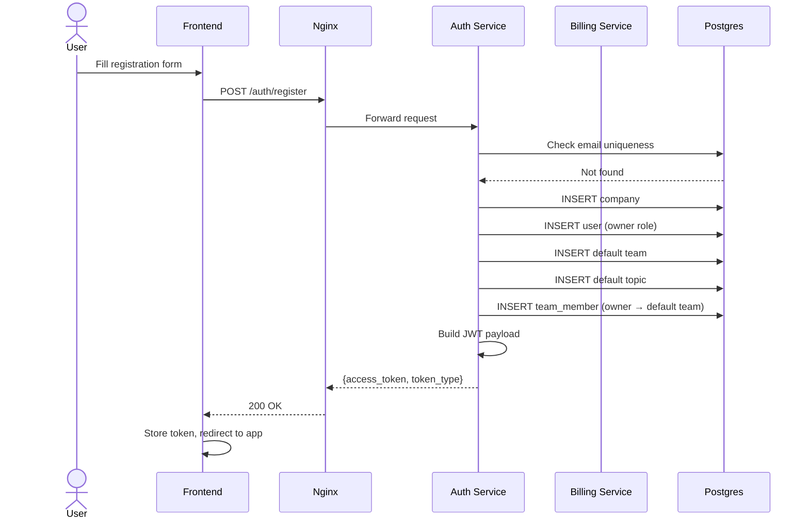
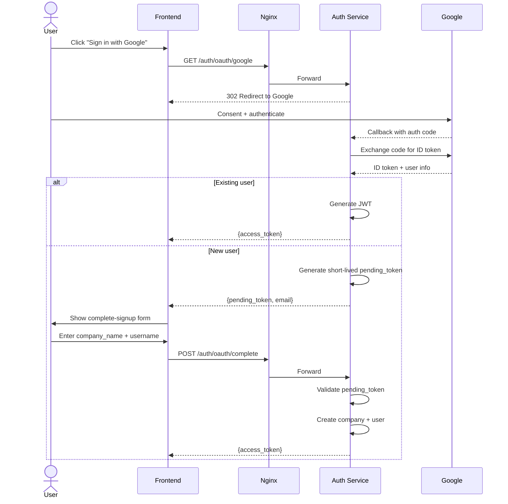
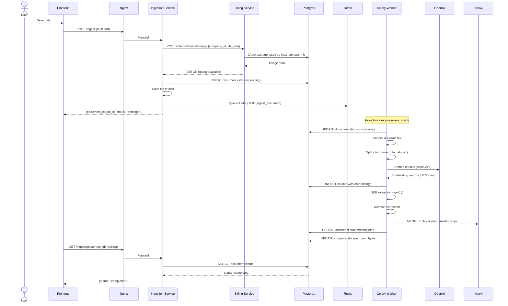
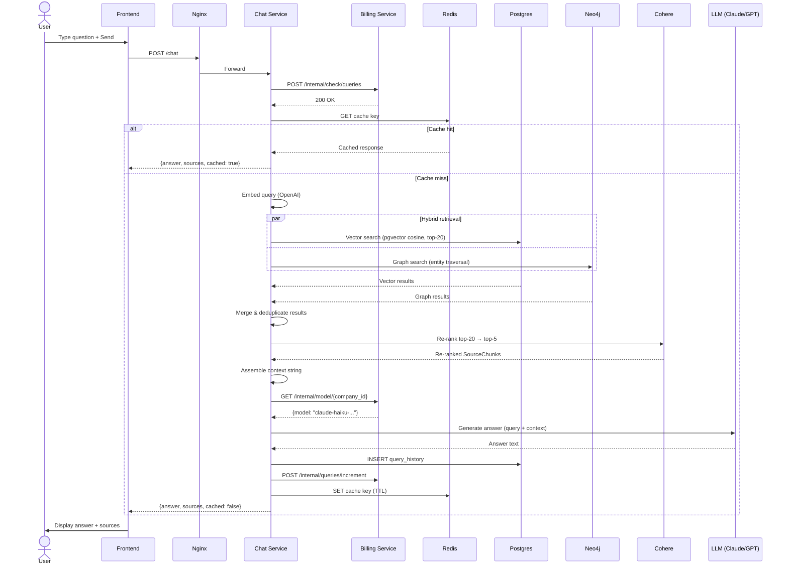
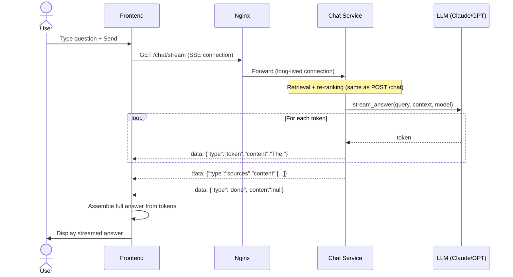
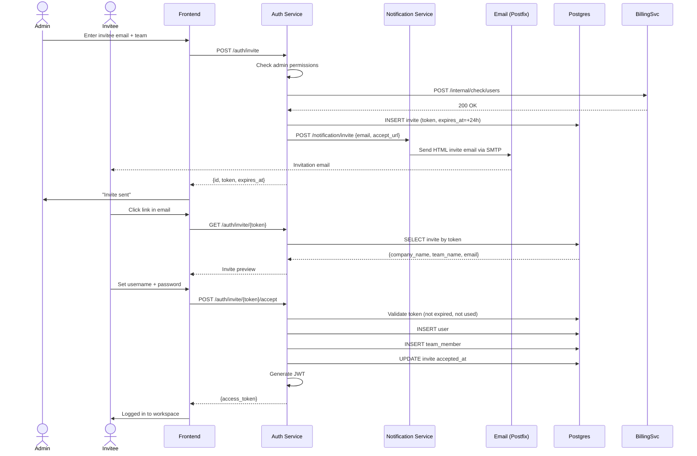
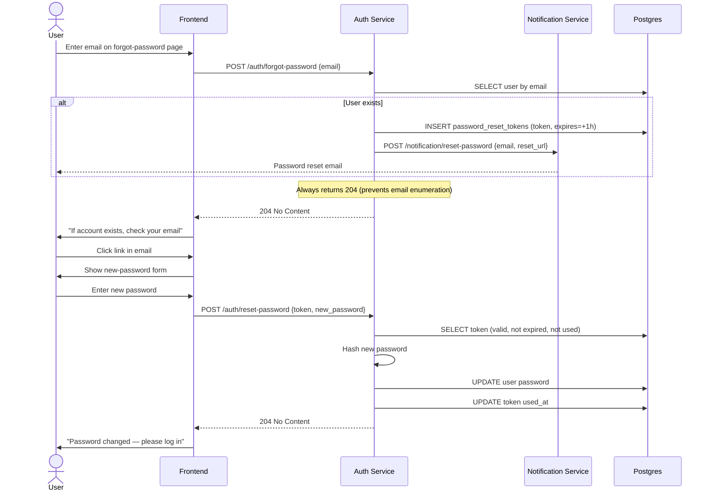

# Sequence Diagrams

## 1. User Registration Flow

---

## 2. Google OAuth Flow

---

## 3. Document Upload & Ingestion

---

## 4. Chat Query (Non-Streaming)

---

## 5. Streaming Chat (SSE)

---

## 6. Team Invitation Flow

---

## 7. Password Reset Flow

